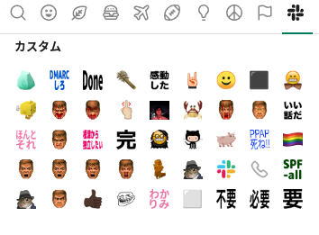

<!-- _class: titlepage -->

# :dmarc-shiro: とはいうけれど話はそう単純ではなくてですね…
## IETF 117 dmarc WG recap
## Ryo Kajiwara, 2023/09/05

----

# 誰？

- 梶原 龍
  - やせいのプログラマ
  - 2021/5に "Email, Messaging, and Self-Sovereign Identity" というトークを研究会でさせていただきました（QRコードはそのスライド）
    - **「SMTPをやめろ」の人**
  - ISOC-JPのOfficerをしています(2020-)

----

# スライド(のソース)は以下のURLから見れます

`https://github.com/sylph01/20230905-wide-email-bof`

----

<!-- email関係治安悪くね？ -->

----