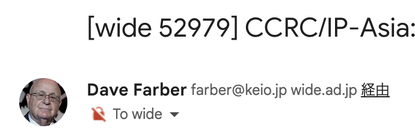
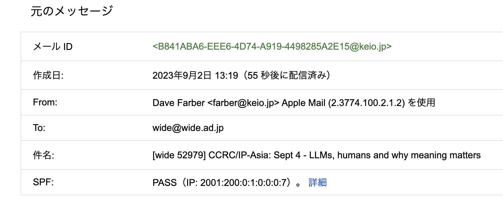
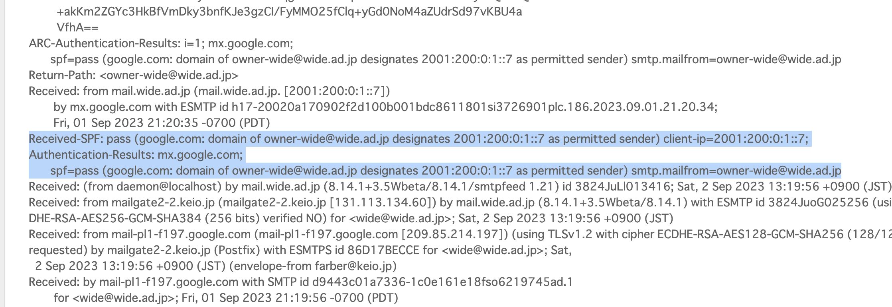
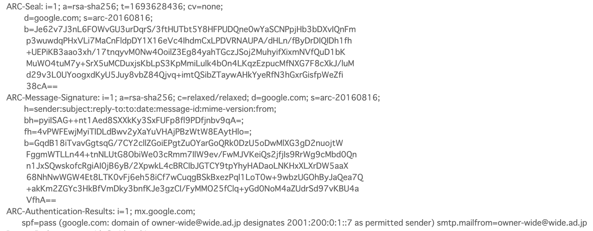

<!-- _class: titlepage -->

# :dmarc-shiro: とはいうけれど話はそう単純ではなくてですね…
## IETF 117 dmarc WG recap
## Ryo Kajiwara, 2023/09/05

----

# 誰？

- 梶原 龍
  - やせいのプログラマ
  - 2021/5に "Email, Messaging, and Self-Sovereign Identity" というトークを研究会でさせていただきました（QRコードはそのスライド）
    - **「SMTPをやめろ」の人**
  - ISOC-JPのOfficerをしています(2020-)

----

# スライド(のソース)は以下のURLから見れます

`https://github.com/sylph01/20230905-wide-email-bof`

----

<!-- email関係治安悪くね？ -->

----

# agenda @ IETF 117 (1)

- `p=reject` の扱いについて
  - メーリングリストと相性が悪い。どうする？
    - no change
    - ARCをstandards trackにする
    - "domains MUST NOT publish restrictive DMARC policies due to interoperability issues"
    - `p=reject` のnormative requirementsを除外し"Interoperability Considerations"セクションに動かす

----

# agenda @ IETF 117 (2)

- DMARCからSPFを除外する提案について
  - （これは **DMARC内においてSPFを判断に利用するかどうかについてのみ**）
  - どうする？
    - no change
    - DMARC considerationからSPFを除外
    - DMARC record tagを追加し、SPF/DKIM/両方を利用することを指定

----

# quick recap: DMARC (RFC 7489)

- ドメインオーナーはDNSレコードでポリシーを公開する
- メール受信者は `From` アドレスを SPF, DKIM, DMARC ポリシーと照合する
  - SPF/DKIM validation domainが `From` のドメインとalignしていることを確認する
- 受信者はそれをもとにメールの取り扱いを決定できる
- 受信者はドメインオーナーになりすましメールに対して通知できる

<!--
Identifier AlignmentについてはRFC 7489 section 3.1
RFC5322 Fromヘッダが用いられるのはこれがrequired headerであるから。

Envelope FromとHeader Fromの一致取るのってどこに記述あるんだっけ？
-->

----

# ところでDMARCは何を解決するの？

DMARC（をはじめとするドメイン認証技術）は **spoofing problemを解決する** のであって **spam problemを解決するのではない。**

これは常時HTTPS化がphishingを解決するのではないのと似ている。phishing siteはHTTPS化してくるし、spammerはSPF/DKIM/DMARCすべてをPASSするspamを送ってくる。

"DMARC solves **direct domain abuse**, not spam"

----

# `p=reject` って何

https://datatracker.ietf.org/doc/html/rfc7489#section-6.3

メール受信者に対して要求するポリシーの一つ。

- `none`: 特に受信者に何も要求しない。
- `quarantine`: DMARC FAILした場合に「怪しい」とフラグを立てることを要求する。spamフォルダ行きなど。
- `reject`: DMARC FAILした場合**SMTPトランザクション中にメールをrejectする。**

----

# DMARC FAILしてるのなんてRFC違反でspam確定なんだからrejectしてよくない？

（その表現が正しいかどうかはさておいて…）

2014年にYahoo、ついでAOLがDMARC policyを `p=reject` にしたところメーリングリストが多数不通になる事案が発生した。

なおこれはDMARCが **まだInternet-Draftであった頃！**

DMARC WGはこのあとに結成されている。WGの歴史的に抱えるトラウマの一つになっているように見える。

<!--
日本語Googleで'dmarc yahoo p=reject'で検索するとYahoo! Japanの最近の取り組みしか出てこない、なので英語版Wikipediaにある事実の記述を確認した。
https://en.wikipedia.org/wiki/DMARC

ちなみにGmailはp=rejectでも実はrejectしない。これは別にRFC違反ではない。代わりに「〜経由」であると表示する。
-->

----

# SPFをDMARCから除外する？なんで？

- SPF (as per RFC 7208) は `MAIL FROM` を検証するのに対して
- DKIM (as per RFC 6376) はDKIM signerが秘密鍵を持っているドメインのどれかについてsignする、としか書かれていない
  - 5.1 Determine Whether the Email Should Be Signed and by Whom
- これらがalignしないことがありうる
- メーリングリストとかだと SPF FAIL の DKIM PASS はよくある

----

# 「『`p=reject` でinteroperability problem引いたことない』は『私はタバコを50年吸ってるけどまだ死んでないぞ』と同じ」

----

# DMARCにおけるmailing list problem

- メーリングリストにおいては
  - 必然的にEnvelope FROMとHeader FROMは不一致になる
  - DKIMの検証ドメイン名とHeader FROMは一致するが、SPFのvalidation domainとHeader FROMのドメイン名が一致しないことがある

----

Gmailにおいては `p=reject` を指定しているドメイン名でもSMTPレイヤーでrejectはせず、「〜経由」と表示するようにしている。mailing list problemを考慮しているため？

<!-- メール選択に他意はなく、たまたまwideのメーリングリストに来てるやつをサンプルにしただけです -->

----

----

- SPFの検証ドメイン名は `wide.ad.jp`
- DMARCの見るHeader FROMは `@keio.jp`
- よって **厳密にはDMARC FAIL!**

----

# ARC

メーリングリストのようなintermediate handlerがそれぞれの検証結果を順番付きで添付することによって、最終受信者が本来意図した通りの検証結果を利用できるようにしたもの。

すっごく雑に言うとintermediate handlerがDKIMをチェーンすることでDKIMが転送されたときに壊れることを防ぐ。

----

----

- `ARC-Message-Signature`: ほぼフォーマットがDKIMなことに注意
  - `i=1`: ARCチェーンの1個目であることを示す。
  - `d=google.com`, `s=arc-20160816`: DKIMと同様に、ドメインとその鍵識別子を示す。
- これを付与した上で `ARC-Seal` が `ARC-Message-Signature` と `ARC-Authentication-Results` の内容に署名している
  - SPFとDKIMの上に署名して、次の検証者が確信を持ってその値を使うことができるようにしている
- 理想的にはメーリングリストが検証したARCをさらにGmailのMTAが検証して…みたいにしたい
  - がまともにARCを実装しているMTAなんてGmailくらいしか存在しない（要出典）

----

# 個人的には(1)

- `p=reject` についてno changesはナシ
  - せめてinteroperability considerationsに何か書いておかないと、メーリングリストで事故を起こすことはそんなに自明ではない
  - ちゃんとRFC読んでない誰かに唆されて `p=reject` にして問題起こす、が起こりうる
    - セキュリティチェックシートの指摘で `p=reject` じゃないのなんでですか、みたいな…

----

# 個人的には(2)

- DKIMのほうがsenderについてより強い保証してるのでDKIM PASSを信用すべきと思う。メーリングリストについても送信者の真正性の検証にはDKIMで十分
  - 一方でメーリングリストではDKIM replay attack…ｳｯ頭が…
  - [DKIM Replayについては2023/3にProblem StatementのI-Dが出ている](https://www.ietf.org/id/draft-crocker-dkim-replay-00.html)
- メーリングリスト + DMARCを本格的にやろうと思ったらARCがもっと実装されてる必要があるけど実際にGmailくらいしかやってないよね？
- ~~みんなまともに実装できてないんだしSMTPやめない？~~

----

# 便利リンク集

- [SPF (RFC 7208)](https://datatracker.ietf.org/doc/html/rfc7208)
- [DKIM (RFC 6376)](https://datatracker.ietf.org/doc/html/rfc6376)
  - [Message Header Field for Indicating Message Authentication Status (RFC 8601)](https://datatracker.ietf.org/doc/html/rfc8601)
- [DMARC (RFC 7489)](https://datatracker.ietf.org/doc/html/rfc7489)
- [ARC (RFC 8617)](https://datatracker.ietf.org/doc/html/rfc8617)
- [Experimental Domain-Based Message Authentication, Reporting, and Conformance (DMARC) Extension for Public Suffix Domains (RFC 9091)](https://datatracker.ietf.org/doc/html/rfc9091)